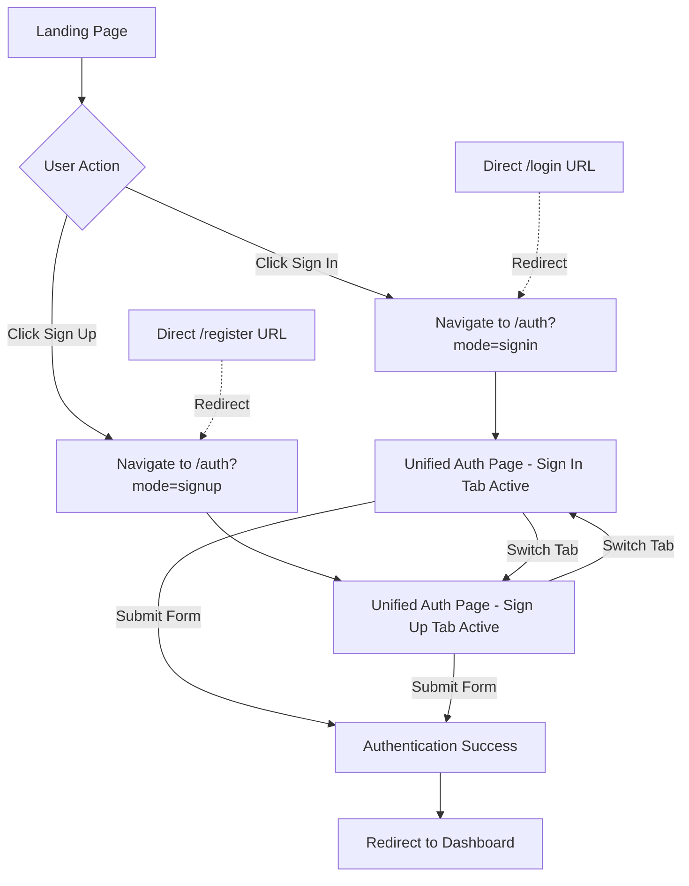

# Authentication Consolidation Plan

## Current State Analysis

### Identified Issues
Your WiW3CH Intelligence Platform currently has **three separate authentication flows**, creating confusion and maintenance overhead:

1. **AuthModal Component** (`/components/AuthModal.tsx`)
   - Modal dialog triggered from landing page navigation and hero
   - Contains both login and signup forms
   - Currently loaded but creates redundant code paths

2. **Standalone Login Page** (`/app/login/page.tsx`)
   - Full-page login form at `/login` route
   - Links to `/register` for signup
   - Separate implementation with different styling

3. **Standalone Register Page** (`/app/register/page.tsx`)
   - Full-page registration form at `/register` route
   - Links to `/login` for existing users
   - Separate implementation with different styling

### Entry Points
- **Landing Navigation** (`LandingNav.tsx`): "Log In" and "Sign Up" buttons trigger AuthModal
- **Landing Hero** (`LandingHero.tsx`): "Log In" and "Sign Up" CTAs trigger AuthModal
- **Direct URL Access**: Users can navigate directly to `/login` or `/register`

## Proposed Solution: Unified Authentication Page

### Architecture Overview

```
Landing Page (/)
    ↓
    ↓ Click "Sign In" or "Sign Up"
    ↓
Unified Auth Page (/auth)
    ├── Tab: Sign In
    └── Tab: Sign Up
    ↓
    ↓ Successful Authentication
    ↓
Dashboard (/dashboard)
```

### Design Specifications

#### Route Structure
- **Primary Route**: `/auth` (new unified authentication page)
- **Query Parameter**: `?mode=signin` or `?mode=signup` (optional, defaults to signin)
- **Deprecated Routes**: `/login` and `/register` will redirect to `/auth`

#### UI Components

**Unified Auth Page** (`/app/auth/page.tsx`)
- Tab-based interface using shadcn/ui Tabs component
- Two tabs: "Sign In" and "Sign Up"
- Shared visual design matching current login/register pages
- Background effects and branding consistent with existing pages
- Responsive layout optimized for mobile and desktop

**Tab Content**
1. **Sign In Tab**
   - Email input field
   - Password field (if implementing full auth)
   - "Sign In" button
   - LinkedIn OAuth option
   - Link to switch to Sign Up tab
   - Demo user hint (maya@example.com)

2. **Sign Up Tab**
   - Full Name input
   - Email input
   - Industry selector
   - "Create Account" button
   - LinkedIn OAuth option
   - Link to switch to Sign In tab

### Implementation Strategy

#### Phase 1: Create Unified Auth Page
1. Create new `/app/auth/page.tsx` with tab-based UI
2. Combine best features from existing login and register pages
3. Implement URL query parameter handling for default tab
4. Maintain existing visual design and branding

#### Phase 2: Update Navigation
1. Update `LandingNav.tsx` to navigate to `/auth?mode=signin` or `/auth?mode=signup`
2. Update `LandingHero.tsx` to navigate to `/auth?mode=signin` or `/auth?mode=signup`
3. Remove AuthModal trigger logic from both components

#### Phase 3: Handle Legacy Routes
1. Update `/app/login/page.tsx` to redirect to `/auth?mode=signin`
2. Update `/app/register/page.tsx` to redirect to `/auth?mode=signup`
3. Keep files for backward compatibility but make them simple redirects

#### Phase 4: Clean Up
1. Remove or archive `AuthModal.tsx` component
2. Update any internal links that reference `/login` or `/register`
3. Test all authentication flows

### Benefits

✅ **Single Source of Truth**: One authentication page to maintain
✅ **Better UX**: Users stay on same page when switching between sign in/sign up
✅ **Reduced Code Duplication**: Shared styling, validation, and logic
✅ **Easier Maintenance**: Updates only need to be made in one place
✅ **Backward Compatible**: Legacy URLs redirect to new unified page
✅ **Cleaner Codebase**: Remove unused AuthModal component

### User Flow Diagram



### Technical Implementation Details

#### File Structure
```
member-intelligence-platform/frontend/
├── app/
│   ├── auth/
│   │   └── page.tsx          # NEW: Unified auth page with tabs
│   ├── login/
│   │   └── page.tsx          # MODIFIED: Redirect to /auth?mode=signin
│   └── register/
│       └── page.tsx          # MODIFIED: Redirect to /auth?mode=signup
├── components/
│   ├── AuthModal.tsx         # DEPRECATED: Remove or archive
│   └── landing/
│       ├── LandingNav.tsx    # MODIFIED: Navigate to /auth
│       └── LandingHero.tsx   # MODIFIED: Navigate to /auth
```

#### Key Technologies
- **Next.js 14** App Router
- **shadcn/ui** Tabs component for tab interface
- **React Hook Form** (optional) for form validation
- **Zustand** store for authentication state management

### Migration Checklist

- [ ] Create `/app/auth/page.tsx` with tab-based UI
- [ ] Implement sign-in form in first tab
- [ ] Implement sign-up form in second tab
- [ ] Add URL query parameter handling
- [ ] Update `LandingNav.tsx` navigation
- [ ] Update `LandingHero.tsx` navigation
- [ ] Convert `/login/page.tsx` to redirect
- [ ] Convert `/register/page.tsx` to redirect
- [ ] Remove AuthModal component
- [ ] Test all authentication flows
- [ ] Update documentation

### Testing Strategy

1. **Navigation Testing**
   - Click "Sign In" from landing nav → Should open /auth with sign-in tab
   - Click "Sign Up" from landing nav → Should open /auth with sign-up tab
   - Click "Log In" from hero → Should open /auth with sign-in tab
   - Click "Sign Up" from hero → Should open /auth with sign-up tab

2. **Legacy URL Testing**
   - Navigate to `/login` → Should redirect to `/auth?mode=signin`
   - Navigate to `/register` → Should redirect to `/auth?mode=signup`

3. **Tab Switching**
   - Switch from sign-in to sign-up tab → Should work smoothly
   - Switch from sign-up to sign-in tab → Should work smoothly
   - URL should update with query parameter

4. **Form Submission**
   - Submit sign-in form → Should authenticate and redirect to dashboard
   - Submit sign-up form → Should register and redirect to dashboard

### Future Enhancements

- Add password reset flow to unified auth page
- Implement email verification flow
- Add social OAuth providers (Google, GitHub)
- Add "Remember Me" functionality
- Implement proper backend authentication integration
- Add form validation with error messages
- Add loading states and animations

## Conclusion

This consolidation will create a cleaner, more maintainable authentication system while improving the user experience. The unified approach eliminates confusion and reduces code duplication, making future updates easier to implement.